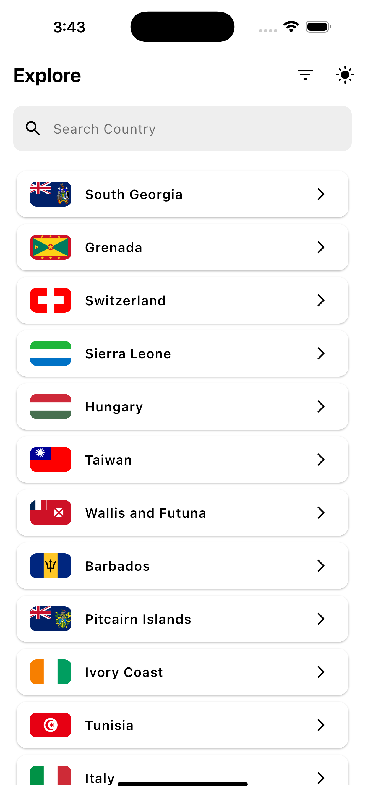
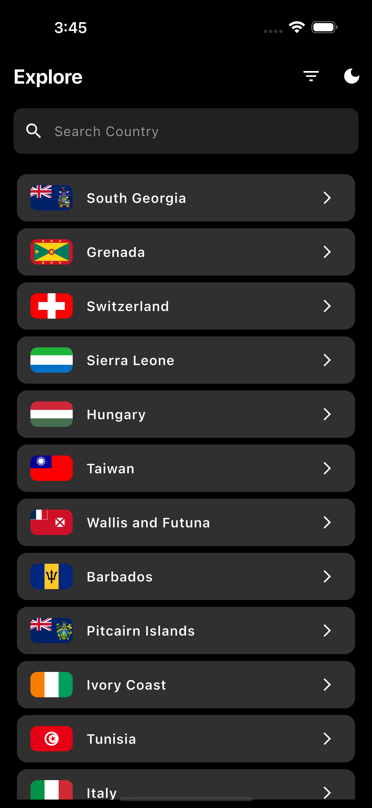

Country Info App

Overview

The Country Info App is a Flutter-based mobile application that provides detailed information about countries worldwide. Users can search for countries, view essential details such as population, capital, president, and continent, and toggle between light and dark themes for a personalized user experience.

Features

Fetches country data from a REST API

Displays country details, including:

Name

Flag

States

Population

Capital

President

Continent

Country Code

Implements a search bar for filtering countries

Supports theme customization with light and dark modes

Optimized for responsiveness across different screen sizes

Hosted on Appetize.io for online demonstration

Technologies Used

Flutter (Dart)

Provider (State Management)

REST API (for fetching country data)

Installation

To run the project locally, follow these steps:

Prerequisites

Ensure you have the following installed:

Flutter SDK

Dart

Android Studio or Visual Studio Code

A physical/emulator device

Steps

Clone the repository:

git clone https://github.com/Seleemmiah/hng_stage2_task.git
cd country_info_app

Install dependencies:

flutter pub get

Run the application:

flutter run

Project Structure

country_info_app/
│-- lib/
│   │-- models/                 # Data models
│   │   ├── models.dart         # Country model
│   │-- providers/              # State management
│   │   ├── theme_provider.dart # Theme provider
│   │-- service/                # API integration
│   │   ├── api_service.dart    # Fetching country data
│   │-- screen/                 # UI screens
│   │   ├── home_page.dart      # Home screen
│   │   ├── details_screen.dart # Country details screen
│   │   ├── filter_screen.dart  # Filter options screen
│   ├── main.dart               # App entry point
│-- pubspec.yaml                # Dependencies and metadata
│-- README.md                   # Project documentation

API Integration

This project fetches country data from a REST API. The API service is implemented in api_service.dart.

Example API Call

Future<List<dynamic>> fetchCountries() async {
  final response = await http.get(Uri.parse('https://restcountries.com/v3.1/all'));
  if (response.statusCode == 200) {
    return json.decode(response.body);
  } else {
    throw Exception('Failed to load countries');
  }
}

Theme Customization

The app supports light and dark themes using the ThemeProvider class.

Toggling Theme

IconButton(
  icon: Icon(themeProvider.isDarkMode ? Icons.dark_mode : Icons.light_mode),
  onPressed: () => themeProvider.toggleTheme(),
)

Deployment

The application is deployed on Appetize.io for live testing. You can access it here.

Light Mode
## Screenshots
| Light Mode | Dark Mode |
|------------|------------|
|  |  |

Contribution

Contributions are welcome! Follow these steps:

Fork the repository

Create a new branch (feature-branch)

Commit your changes

Push to your branch

Open a pull request

License

This project is open-source and available under the MIT License.

